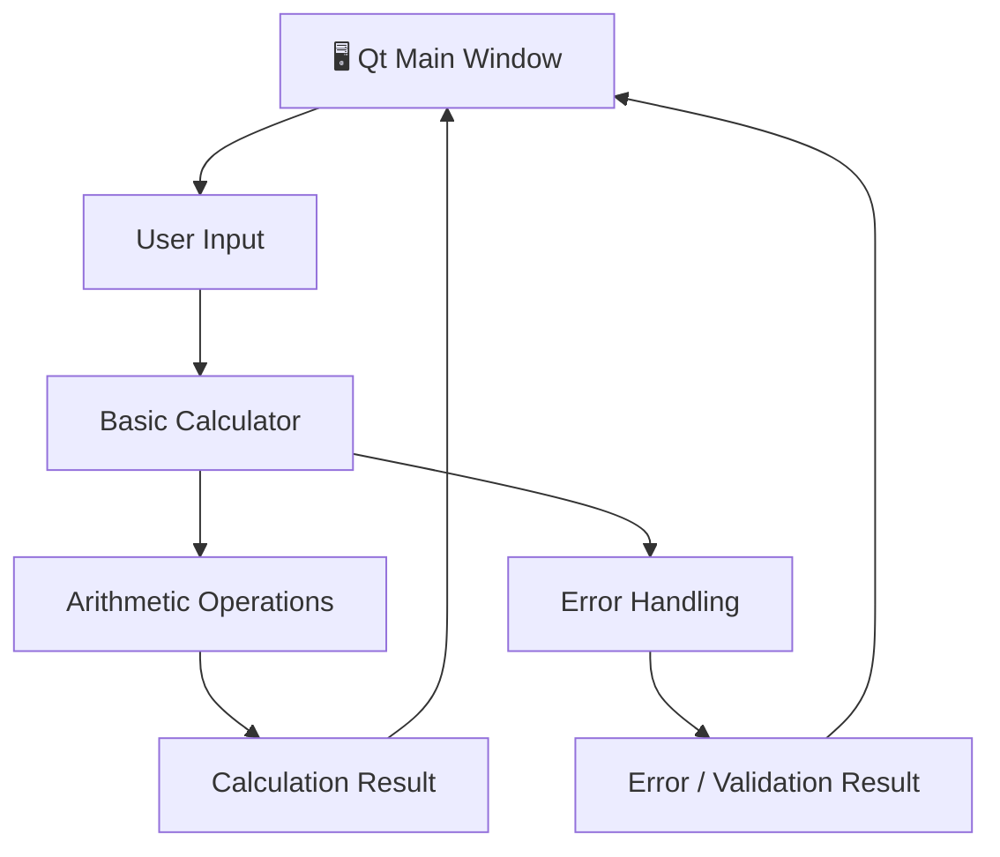

<div align="center">

# 🧮 My Calculator

### A Clean Desktop Calculator Built with C++ & Qt

<p>
  
  
  
  
  
</p>

<p>
  A lightweight calculator application developed in <b>C++</b> with a <b>Qt</b> graphical interface,
  with calculation logic and error handling separated from the presentation layer.
</p>

</div>

---

## 📖 Overview

**My Calculator** is a lightweight desktop calculator built using **C++ and Qt Creator**.

The project combines a Qt-based graphical interface with a separate calculation layer responsible for performing arithmetic operations and handling invalid input.

The application is intentionally structured into independent components, making the calculator easy to understand, maintain, and extend.

> **Simple interface. Clean implementation. Built as a foundation for a more capable expression calculator.**

---

## ✨ Features

| Feature           | Description                            |
| :---------------- | :------------------------------------- |
| ➕ Addition        | Adds two values                        |
| ➖ Subtraction     | Subtracts one value from another       |
| ✖️ Multiplication | Multiplies two values                  |
| ➗ Division        | Divides two values with error handling |
| ⚠️ Error Handling | Handles invalid calculation states     |
| 🖥️ Desktop GUI   | Built with Qt Widgets                  |
| 🧩 Modular Design | Calculation and UI logic are separated |
| 🔧 CMake          | Cross-platform project configuration   |

---

## 🏗️ Architecture

The application separates the **user interface** from the **calculation and validation logic**.



### Application Flow

```text
User
 │
 ▼
┌─────────────────────┐
│     Qt Interface    │
│     MainWindow      │
└──────────┬──────────┘
           │
           ▼
┌─────────────────────┐
│  Calculation Layer  │
│   BasicCalculate    │
└──────────┬──────────┘
           │
     ┌─────┴─────┐
     ▼           ▼
┌─────────┐  ┌──────────────┐
│Arithmetic│  │Error Handling│
│Operations│  │ & Validation │
└────┬────┘  └──────┬───────┘
     │              │
     └──────┬───────┘
            ▼
       Calculation
          Result
```

---

## 🧠 Core Components

### `BasicCalculate`

The `BasicCalculate` component contains the core arithmetic functionality of the calculator.

It is responsible for performing the fundamental operations required by the application.

```text
BasicCalculate
      │
      ├── Addition
      ├── Subtraction
      ├── Multiplication
      └── Division
```

Keeping these operations separate from the GUI allows the calculation logic to remain independent of Qt's interface code.

---

### `Error_Handling`

The project includes a dedicated error-handling component for dealing with invalid calculation conditions.

This keeps validation and error-related behavior separate from the main arithmetic implementation.

```text
Input
  │
  ▼
Validation
  │
  ├── Valid ──────► Calculate
  │
  └── Invalid ────► Error Handling
```

---

### `Types`

The `Types` component provides shared type definitions used by the calculator implementation.

Keeping common definitions in a dedicated header makes the rest of the application easier to organize and maintain.

---

### `MainWindow`

`MainWindow` represents the Qt presentation layer.

It is responsible for:

* Displaying the calculator interface
* Receiving user interaction
* Connecting UI actions to calculator operations
* Displaying results
* Displaying errors

This keeps the graphical interface separate from the underlying calculation logic.

---

## 📁 Project Structure

```text
My-Calculator/
│
├── 📂 resources/
│
├── 📂 src/
│   │
│   ├── 🧮 BasicCalculate.cpp
│   ├── 🧮 BasicCalculate.h
│   │
│   ├── ⚠️ Error_Handling.cpp
│   ├── ⚠️ Error_Handling.h
│   │
│   ├── 🔤 Types.h
│   │
│   ├── 🚀 main.cpp
│   │
│   ├── 🖥️ mainwindow.cpp
│   ├── 🖥️ mainwindow.h
│   └── 🎨 mainwindow.ui
│
├── 🔧 CMakeLists.txt
├── ⚙️ CMakeLists.txt.user
├── 📜 LICENSE
└── 📄 README.md
```

The current repository follows this separation between the `src` implementation and the CMake project configuration.

---

## 🛠️ Tech Stack

| Technology     | Purpose                  |
| :------------- | :----------------------- |
| **C++**        | Core application logic   |
| **Qt 6**       | Graphical user interface |
| **Qt Widgets** | Desktop UI components    |
| **CMake**      | Build configuration      |
| **Qt Creator** | Development environment  |

---

## 🚀 Getting Started

### Prerequisites

Make sure you have the following installed:

* **Qt 6**
* **Qt Creator**
* **CMake**
* A compatible **C++ compiler**

### Clone the Repository

```bash
git clone https://github.com/HamdanTariq26/My-Calculator.git
```

```bash
cd My-Calculator
```

### Build with Qt Creator

1. Open **Qt Creator**.
2. Select **Open Project**.
3. Open `CMakeLists.txt`.
4. Select a compatible Qt kit and compiler.
5. Configure the project.
6. Build the project.
7. Run the application.

---

## 🧮 Current Capabilities

The current implementation provides the foundation for a desktop calculator with basic arithmetic operations.

```text
        ┌───────────────┐
        │    Numbers    │
        └───────┬───────┘
                │
                ▼
       ┌────────────────┐
       │   Operations   │
       ├────────────────┤
       │       +        │
       │       −        │
       │       ×        │
       │       ÷        │
       └───────┬────────┘
               │
               ▼
       ┌────────────────┐
       │     Result     │
       └────────────────┘
```

The repository is currently focused on basic arithmetic while providing a foundation that can be extended into a more complete expression-based calculator.

---

## 🔮 Roadmap

The project can be extended with more advanced expression-processing capabilities.

### Planned

* [ ] Bracket / parenthesis support
* [ ] Complex expression evaluation
* [ ] Operator precedence
* [ ] Improved expression parsing
* [ ] Scientific operations
* [ ] Calculation history
* [ ] Keyboard shortcuts
* [ ] Enhanced error messages

---

## 🎯 Project Goals

The project focuses on building a calculator while practicing clean separation between:

```text
        User Interface
              │
              ▼
       Application Logic
              │
       ┌──────┴──────┐
       ▼             ▼
 Calculations    Validation
```

This structure provides a foundation that can evolve from a basic calculator into a more capable expression-processing application.

---

## 📚 What This Project Demonstrates

* C++ application development
* Qt Widgets
* GUI event handling
* Object-oriented design
* Modular application architecture
* Error handling
* CMake-based project configuration
* Separation of UI and business logic

---

## 📜 License

This project is licensed under the **MIT License**.

See the [`LICENSE`](LICENSE) file for details.

---

<div align="center">

### Built with C++ & Qt

**[⬆ Back to Top](#-my-calculator)**

</div>
